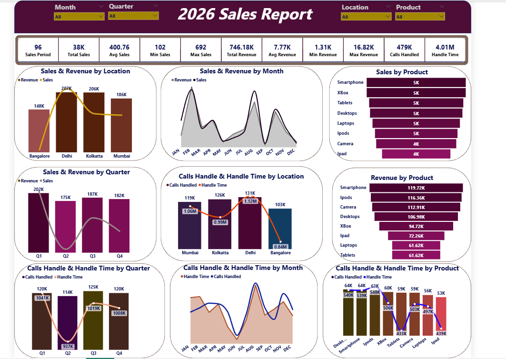

# 📊 Advance Sales Dashboard — Power BI

An interactive Power BI dashboard analyzing **sales, revenue, and call-center performance** across products, locations, and time — built with dynamic slicers, combo charts, and slicer-aware chart titles driven entirely by DAX.



---

## 🔎 Overview

A single-page 2026 sales report combining two business perspectives:

- **Sales & Revenue performance** — by location, month, quarter, and product
- **Call-center performance** — calls handled and handle time, sliced the same way

Four global slicers (**Month, Quarter, Location, Product**) drive every visual on the page, and every chart title updates dynamically via DAX to reflect the current filter context.

---

## 📈 Key Metrics

| Metric | Value |
|---|---|
| Sales Periods | 96 |
| Total Sales | 38K units |
| Avg / Min / Max Sales | 400.76 / 102 / 692 |
| Total Revenue | 746.18K |
| Avg / Min / Max Revenue | 7.77K / 1.31K / 16.82K |
| Calls Handled | 479K |
| Total Handle Time | 4.01M (seconds) |

---

## 📁 Repository Structure

```
advance-sales-dashboard-powerbi/
├── README.md
│
├── documentation/
│   ├── 01_Project_Overview.md
│   ├── 02_Business_Requirements.md
│   ├── 03_Data_Preparation.md
│   ├── 04_Data_Model.md
│   ├── 05_DAX_Measures.md
│   ├── 06_Dashboard_Explanation.md
│   ├── 07_Business_Insights.md
│   └── 08_Recommendations.md
│
├── powerbi/
│   └── Advance_Sales_Dashboard.pbix
│
├── screenshots/
│   └── dashboard_page_1.png
│
└── data/
    └── raw_data_export.csv
```
---

## 📖 Documentation

| Doc | Contents |
|---|---|
| [01 — Project Overview](documentation/01_Project_Overview.md) | Purpose, objectives, scope, tools |
| [02 — Business Requirements](documentation/02_Business_Requirements.md) | Stakeholder questions, functional/non-functional requirements |
| [03 — Data Preparation](documentation/03_Data_Preparation.md) | Source shaping, derived columns, data quality notes |
| [04 — Data Model](documentation/04_Data_Model.md) | Tables, columns, cardinality, relationship notes |
| [05 — DAX Measures](documentation/05_DAX_Measures.md) | All 13 measures with explanations |
| [06 — Dashboard Explanation](documentation/06_Dashboard_Explanation.md) | Walkthrough of every visual on the report |
| [07 — Business Insights](documentation/07_Business_Insights.md) | Data-driven findings by location, product, and quarter |
| [08 — Recommendations](documentation/08_Recommendations.md) | Actionable next steps, commercial + operational |

---

## 🛠️ Tech Stack

- Power BI Desktop
- DAX (dynamic measures, CONCATENATEX-based slicer-aware titles)
- Tabular model (compatibility level 1600)

---

## 👤 Author

Aquarm Bright Yaw — Power BI & data analytics portfolio project.
